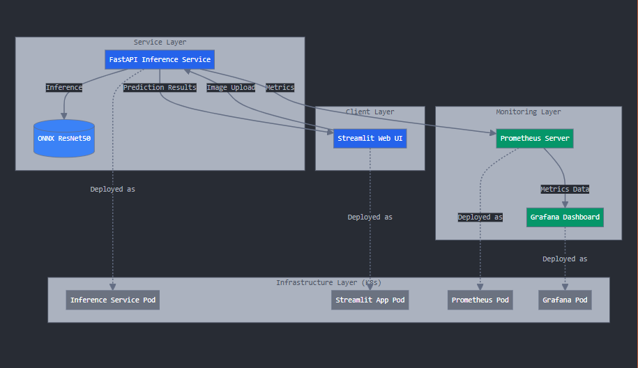
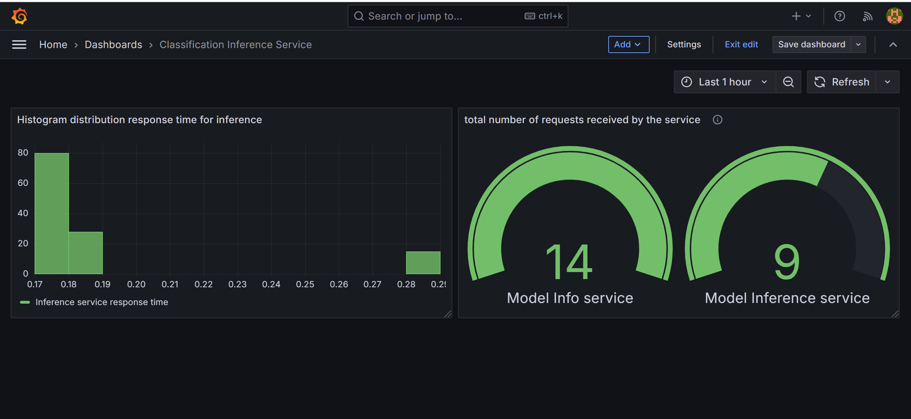

# classification-service-monoitoring

This repository implements a complete ML model lifecycle with automated training, serving, and monitoring using Minikube, MLflow, MinIO, and Prometheus.

## Prerequisites

- Docker
- Minikube

## Project Structure

```
classification-service-monitoring/
├── apps/
│   ├── classification-inference-service/
│   │   ├── Dockerfile
│   │   ├── main.py
│   │   ├── requirements.txt
│   │   ├── resnet50-v2-7.onnx/
│   └── streamlit-app/
│       ├── Dockerfile
│       ├── app.py
│       ├── requirements.txt
├── k8s/
│   ├── classification-inference-service/
│   │   ├── deployment.yaml
│   ├── prometheus-server/
│   │   ├── configmap.yaml
│   └── streamlit-app/
│       ├── deployment.yaml
├── visualisation/
│   ├── grafana/
│   │   ├── dashboard.json
├── namespace.yaml
├── Makefile
└── README.md
```

## System Architecture



The above diagram shows the overall system architecture including the interaction between different components.

- The architecture depicts a modern image classification system with a Streamlit frontend for user interactions and a FastAPI backend service handling model inference using ONNX ResNet50. 

- The system is containerized and deployed on Kubernetes for scalability and reliability, with each component (UI, inference service, monitoring tools) running in separate pods. 

- Prometheus and Grafana are integrated for comprehensive monitoring, tracking metrics like request counts and latency distributions. 

## Deployment Instructions

### 1. Start Minikube

```bash
# Start Minikube with Docker driver
minikube start --driver=docker

# Enable required addons
minikube addons enable metrics-server

# Set Docker environment to use Minikube's Docker daemon
eval $(minikube docker-env)
```

### 2. Build Docker Images

Build all required Docker images in Minikube's Docker daemon:

```bash
# Classification service
docker build -t classification-inference-service:latest -f apps/classification-inference-service/Dockerfile apps/classification-inference-service/

# Web app visualisation streamlit
docker build -t streamlit-app:latest -f apps/streamlit-app/Dockerfile apps/streamlit-app/
```

### 3. Deploy Services

Either use [Makefile](/Makefile) or Apply Kubernetes manifests in the following order:

```bash
# Apply the namespace
kubectl apply -f namespace.yaml

# Apply k8 deployment manifest for classification service
kubectl apply -f k8s/classification-inference-service/   --namespace=classification-inference

# Apply k8 deployment manifest for webapp
kubectl apply -f k8s/streamlit-app/    --namespace=classification-inference

```
### 4. Monitoring setup


```bash
# Add the Prometheus Helm repository:

helm repo add prometheus-community https://prometheus-community.github.io/helm-charts
helm repo update

# Deploy prometheus
helm install prometheus prometheus-community/prometheus

# Edit config map to add inference service metrics to prometheus.
kubectl apply -f k8s/prometheus/configmap.yaml -n default
```

```bash
# Add the Grafana Helm repository:

helm repo add grafana https://grafana.github.io/helm-charts
helm repo update

# Deploy grafana
helm install grafana grafana/grafana
```

### 5. Access Services

Access the deployed services using Minikube service command:

```bash
# Expose classification inference apis externally 
minikube service classification-inference-service --url -n classification-inference
```

```bash
# Access streamlit web app via url
minikube service streamlit-service --url -n classification-inference
```


```bash
# Get Prometheus UI URL
minikube service prometheus-service --url
```

```bash
# Get Grafana UI URL
minikube service grafana --url
```


## Service Details

### Prometheus
- Prometheus is an open-source monitoring and alerting toolkit used for storing and querying time series data.
- Access using the URL provided by Minikube service command
- Default credentials (unless modified in secrets):
  - Username: admin
  - password: prom-admin

### Grafana
- Grafana is an open-source platform for monitoring and observability. It allows you to visualize data from multiple sources, including Prometheus.
- Username: admin
- To generate a new password for Grafana, run the following command:
```bash
kubectl -n classification-inference get secret grafana -o jsonpath="{.data.admin-password}" | base64 --decode ; echo
```
- Access the UI using the provided Minikube service URL


### 6. Visualisation Dashboard

- Import [dashboard.json](/visualisation/grafana/dashboard.json) in Grafana Web App UI.
- After uploading the file, Grafana will automatically parse the JSON and display a preview of the dashboard.
- Set the Dashboard Name: You can specify a name for the new dashboard if you want to change it.
- Select the Folder: Choose a folder where the dashboard will be saved or leave it as the default.
- Datasource Selection: Select Prometheus as the data source for this project.

